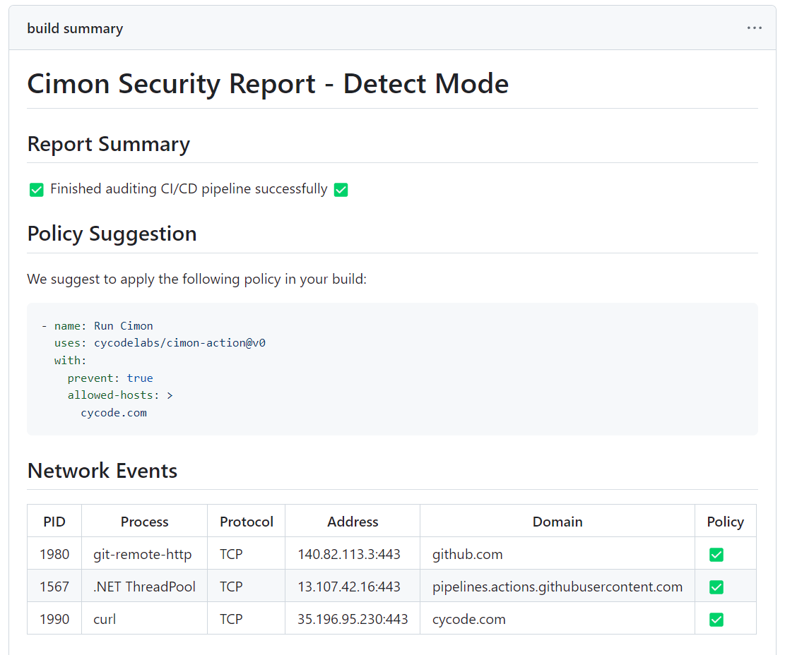

# Secure your CI with Cimon

Cimon (pronounced "Simon") detects and stops software supply-chain attacks, including those targeting SolarWinds and CodeCov, through a developer-friendly experience.

By utilizing the revolutionary eBPF technology, Cimon monitors and mitigates attacks within the kernel, denying access to users' assets as soon as they arise.

This action helps seamlessly deploy the agent into any desired GitHub Actions build. The action is based on the NodeJS engine and contains simple `pre` and `post` scripts to deploy and gracefully shut down the agent.

## Getting Started

In order to integrate Cimon with GitHub, simply introduce the action in your GitHub Action workflow as follows:

``` yaml
steps:
  - uses: cycodelabs/cimon-action@v0
    with:
      prevent: true
      allowed-ips: ...
      allowed-hosts: ...
```

## Usage

The action supports the following parameters:

| Name                     | Default                             | Description                                                                                                                                                                 |
|--------------------------|-------------------------------------|-----------------------------------------------------------------------------------------------------------------------------------------------------------------------------|
| `client-id`              |                                     | Cimon client ID for authentication                                                                                                                                          |
| `secret`                 |                                     | Cimon secret for authentication                                                                                                                                             |
| `prevent`                | `false`                             | Enable prevention mode                                                                                                                                                      |
| `allowed-ips`            |                                     | A comma or white space separated list of allowed IP addresses                                                                                                               |
| `allowed-hosts`          |                                     | A comma or white space separated list of allowed domain names. The left-most label can be the wildcard character (`*`) to match multiple subdomains (e.g. `*.example.com`). |
| `github-token`           | `${{ github.token }}`               | GitHub token (used to overcome GitHub rate limiting)                                                                                                                        |
| `report-job-summary`     | `true`                              | Report results through job summary output                                                                                                                                   |
| `report-process-tree`    | `false`                             | Enable to report the process tree                                                                                                                                           |
| `report-artifact-log`    | `true`                              | Report logs through job artifact                                                                                                                                            |
| `slack-webhook-endpoint` |                                     | Slack webhook endpoint to report security events                                                                                                                            |
| `apply-fs-events`        | `false`                             | Enable processing filesystem events and display them in the process tree report                                                                                             |
| `docker-image`           | `docker.io/cycodelabs/cimon:v0.4.0` | Docker image reference                                                                                                                                                      |
| `docker-image-pull`      | `false`                             | Skip pulling image from registry (Used for debugging)                                                                                                                       |
| `docker-username`        | `false`                             | Username to pull image from registry (Used for debugging)                                                                                                                   |
| `docker-password`        | `false`                             | Password to pull image from registry (Used for debugging)                                                                                                                   |
| `log-level`              | `info`                              | Log level (Used for debugging)                                                                                                                                              |

## Scenarios

### Running Cimon on detect mode

``` yaml
steps:
  - uses: cycodelabs/cimon-action@v0
```

### Running Cimon on prevent mode

``` yaml
steps:
  - uses: cycodelabs/cimon-action@v0
    with:
      prevent: true
      allowed-hosts: >
        cycode.com
```

### Running Cimon on detect mode with a process tree and file system events

``` yaml
steps:
  - uses: cycodelabs/cimon-action@v0
    with:
      report-process-tree: true
      apply-fs-events: true
```
## Security Report

Each pipeline run will report its findings through a security report embedded within the pipeline summary in GitHub Actions. 

Here is an example of a Cimon report:



The report, created as a job summary, contains the profile of the running job based on the configuration and includes a snippet to assist the user with transitioning from detection to prevention.

When the policy is set to "prevent", any security anomalies matching the profile are displayed on the report:


## Development

Contributions to GitHub Action are welcome. After changes were made to the `src` folder, these changes should be reflected to the `dist` folder through the following build process:

1. Install or update package dependencies:
   ```
   npm install
   ```
2. Compile JavaScript source files into single entrypoint files with [ncc]:
   ```
   npm run all
   ```

The build script will update the actions' entry points code in the [dist](dist) directory, which should be added to the Git repository.

[ncc]: https://github.com/vercel/ncc

## License

[Apache License 2.0](./LICENSE.md)